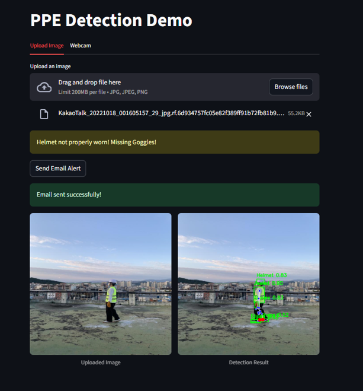
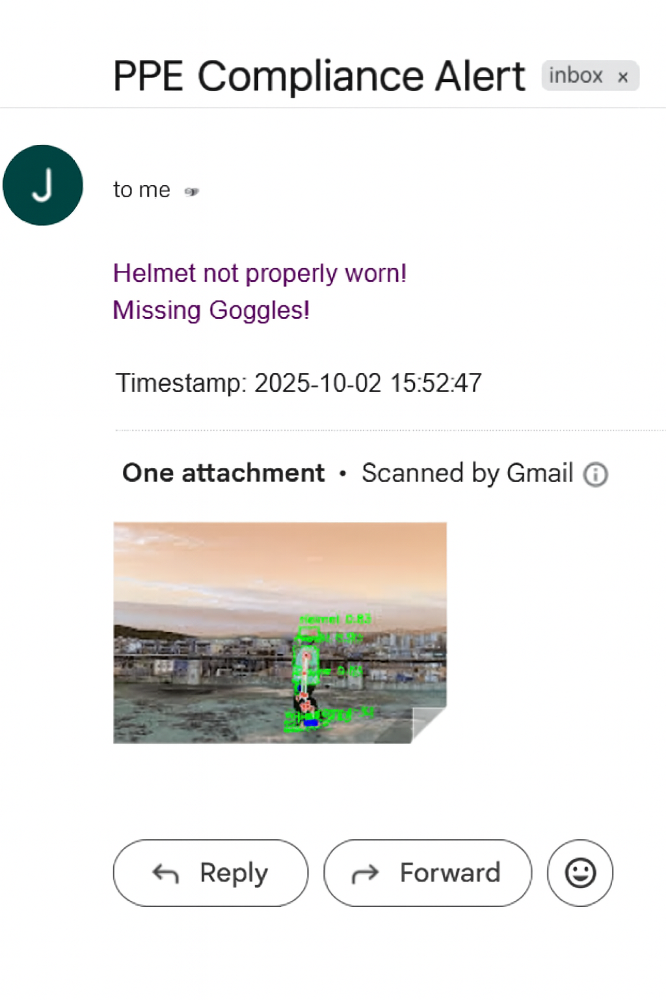

[](https://your-streamlit-cloud-link.streamlit.app)

# 🦺 PPE Compliance Detection (YOLOv8 + Pose + Email Alerts)

<!-- Badges -->
 
 
 
 


This repository provides a **Personal Protective Equipment (PPE) monitoring system** that detects whether safety gear such as **helmet, gloves, vest/jacket, goggles, and boots** are properly worn.  

It uses **YOLOv8** for detection, **optional Mask R-CNN refinement**, and **MediaPipe Pose** for pose-based checks. The system can also send **email alerts with snapshots** when non-compliance is detected.

---

## 🎬 Demo
Try the live demo on **Streamlit Cloud**:  

👉 [Streamlit Cloud Demo Link](#) 

## 📂 Project Structure
```
PPE/
├── train.py           # Train YOLOv8 on your dataset
├── inference.py       # Live webcam inference + optional Mask R-CNN + Pose + email alerts
├── app.py             # Streamlit web app for interactive demos
├── cudacheck.py       # Quick CUDA/GPU sanity check
├── datasets/          # Train/val/test images (YOLO format)
├── runs/              # Training outputs and weights
├── models/            # Auxiliary model configs (pose, face, etc.)
├── requirements.txt   # Python dependencies
├── .env.example       # Environment variable template
└── demo/              # Demo assets (Output screenshots)
```

---

## ⚙️ Prerequisites
- **OS**: Windows 10/11 or Linux  
- **Python**: 3.10 – 3.12  
- **Optional GPU**: NVIDIA GPU + CUDA (set `device='cuda'`). CPU is supported by default.  

---

## 🔧 Installation
```bash
# Upgrade pip and install dependencies
python -m pip install --upgrade pip
pip install -r PPE/requirements.txt --extra-index-url https://download.pytorch.org/whl/cpu
```

> ⚡ **Note:** If you have CUDA, replace the index URL with the appropriate CUDA wheel index from [PyTorch downloads](https://pytorch.org/get-started/locally/). Ensure your PyTorch build matches your installed CUDA version.

---

## 📊 Dataset Configuration
Update `PPE/data.yaml` with relative paths for portability:
```yaml
train: datasets/train/images
val: datasets/valid/images
test: datasets/test/images

nc: 5
names: ['boots', 'glasses', 'gloves', 'helmet', 'vest']
```

- Dataset must be in **YOLO format**.  
- You may modify `names` if using a custom dataset with different PPE categories.  

---

## 🚀 Training
From the project root:
```bash
python PPE/train.py
```
Training outputs are saved in:
```
runs/train/<experiment_name>
```

---

## 📌 Usage Options

This repository provides two main ways to run PPE detection:

### 1. Command-Line/Script Mode (`inference.py`)
- Use for **batch processing, automation, or continuous monitoring**.  
- Supports **webcam inference + email alerts**.  
- **Email alerts are triggered automatically** when PPE violations are detected.  
- Run with:
  ```bash
  python PPE/inference.py
  ```

### 2. Streamlit Web App (`app.py`)
- Use for **interactive demos, image uploads, or webcam snapshots via browser**.  
- Provides a **user-friendly interface** for quick tests.  
- **Note:** Processes only single images or snapshots (not continuous video).  
- Run locally with:
  ```bash
  streamlit run PPE/app.py
  ```

---

## 🌍 Environment Variables
This project uses **environment variables** for email alerts and deployment.  

Copy `.env.example` → `.env` and fill in your values:  
```ini
PPE_WEIGHTS_PATH=runs/train/best9/weights/best.pt
SMTP_SERVER=smtp.gmail.com
SMTP_PORT=587
SENDER_EMAIL=your_email@gmail.com
SENDER_PASSWORD=your_app_password
RECEIVER_EMAIL=receiver_email@gmail.com
```

### Notes:
- For Gmail, use an **App Password** instead of your main password.  
- Multiple recipients can be supported by comma-separating emails.  
- Streamlit Cloud users should configure these values in the app settings.  

---

## 🖥️ GPU Sanity Check
```bash
python PPE/cudacheck.py
```
---

## 📸 Example Outputs

### Sample Detection


### Email Alert


## 📜 License
This project is licensed under the **MIT License**.  
You are free to use, modify, and distribute it with attribution.  

See the [LICENSE](LICENSE) file for details.  

---

